# M4.2B — rapport final (2026-08-06)

**Statut** : ce document synthétise l'ensemble du programme M4.2B — phase
pilote (30 juillet), campagne d'exploration (87 runs, 29 cellules × 3
graines), campagne de confirmation (45 runs, 9 cellules × 5 graines
**disjointes**, jamais vues avant). Après trois tentatives de test
d'existence de la queue de Pareto (§4), aucune n'a pu trancher : ce
rapport pose désormais l'existence comme **hypothèse de travail** et
caractérise l'exposant α̂ et son incertitude à trois échelles
(intra-instantané, inter-instantanés, inter-graines), plutôt que de
rendre un verdict pass/fail. Les résultats numériques (§5-§6) sont
établis sur la confirmation quand une cellule y figure, sur l'exploration
sinon — chaque valeur est marquée en conséquence. Document autonome :
contexte, grandeurs et méthode sont rappelés avant d'être utilisés
(§1-4), et chaque affirmation quantitative est accompagnée d'une figure
la rendant lisible sans avoir à recalculer quoi que ce soit.

Terminologie : **Fait observé** (mesuré directement) / **Inférence**
(interprétation appuyée sur plusieurs faits) / **Hypothèse** (mécanisme
proposé, pas établi) / **Incertitude** (non tranché).

---

## 1. Contexte : le programme M4.2B en deux phrases

M4.2B est une simulation multi-agents d'une économie de crédit : des
entités abstraites empruntent, prêtent, se versent des intérêts, et
peuvent faire faillite — une faillite pouvant en déclencher d'autres en
cascade (« avalanche »). Le programme poursuit deux objectifs
**simultanés** :

- **Objectif A** — Le revenu d'intérêt réellement perçu par chaque
  entité à un instant donné a-t-il, dans une région significative de
  l'espace des paramètres, une distribution à queue épaisse de type
  **Pareto**, et cette queue peut-elle être pilotée de façon
  reproductible en agissant sur la structure du marché du crédit — en
  particulier sur l'intensité des appariements emprunteur/prêteur
  (paramètre η, voir §3) ?
- **Objectif B** — Quel que soit le réglage trouvé pour l'objectif A, il
  ne doit pas détruire une propriété déjà établie dans les versions
  antérieures du modèle : la taille des cascades de faillites suit une
  loi de puissance, signature d'une dynamique proche d'un point
  critique.

La modification constitutive de M4.2B (par rapport à M4.2) est la
**cible de principal arithmétique** : lors d'une rencontre entre un
prêteur de capital $K_\ell$ et un emprunteur de capital $K_b$
($K_\ell>K_b$), les deux capitaux sont ramenés exactement à leur
moyenne $(K_\ell+K_b)/2$ (contre une cible géométrique
$\sqrt{K_\ell K_b}$ en M4.2). Le taux d'intérêt lui-même est inchangé
(moyenne géométrique des rendements marginaux des deux parties).

## 2. Méthode : trois phases, un budget de calcul croissant

1. **Phase pilote** (30 juillet) : quelques dizaines de runs choisis à
   la main pour maximiser l'information causale (baseline, contrôle
   géométrique, balayages σ et λ) avant tout engagement de calcul dans
   une grille exhaustive.
2. **Campagne d'exploration** : 29 combinaisons de paramètres
   (« cellules »), chacune sur 3 graines aléatoires (0, 1, 2), 3000 pas
   de temps simulés (une cellule à 10 000 pas pour vérifier l'horizon
   long) — 87 runs, tous terminés avec succès. Repère où, dans l'espace
   des paramètres, il se passe quelque chose d'intéressant.
3. **Campagne de confirmation** : 9 cellules retenues d'après
   l'exploration, chacune sur **5 graines nouvelles** (10 à 14, jamais
   vues pendant l'exploration), mêmes critères numériques que ceux fixés
   *avant* de lancer l'exploration — 45 runs, tous terminés avec succès.
   C'est la confirmation, pas l'exploration, qui établit les verdicts de
   ce rapport (§5).

Les 9 cellules de confirmation, et pourquoi elles ont été choisies (3
motifs autorisés : effet le plus net sur le mécanisme de prix des
intérêts, stabilité de seuil elle-même, ou comportement d'avalanche
intéressant — détail dans `report/selection_confirmation.md`) :

| Cellule | Paramètre testé | Motif de sélection |
|---|---|---|
| `rho_0.125`, `rho_4` | η linéaire, extrêmes | effet le plus net sur tous les diagnostics |
| `K0_1`, `K0_2000` | K0, extrêmes | branche prioritaire (mécanisme deg_out) |
| `gamma_0.6667` | γ, effet le plus net (brut) | cartographie de la concavité |
| `control_geometric` | cible géométrique (M4.2) | comparaison institutionnelle, nécessaire à la question 1 |
| `deltasigma_0.1_0.1` | δ=σ=0,10 | seule cellule à sortir du bruit sur la stabilité de seuil |
| `gamma_comp_0.3333`, `gamma_comp_0.6667` | γ, K0 compensé | effet γ le plus propre une fois l'échelle contrôlée |

## 3. Repères : ce que mesurent les grandeurs citées plus loin

- **K0** : le capital de départ d'une entité nouvellement créée.
- **K\*aut** : le capital vers lequel une entité isolée convergerait
  naturellement à long terme (équations de production/dépréciation du
  modèle). Ce qui compte est le rapport K0/K\*aut, pas la valeur brute
  de K0.
- **γ** : la concavité de la fonction de production. γ petit =
  rendements fortement décroissants ; γ proche de 1 = rendements presque
  linéaires.
- **η** : le nombre de tentatives d'appariement emprunteur/prêteur à
  chaque pas de temps. Famille **linéaire** (facteur ρ, ρ=1 =
  référence) et famille **non linéaire** (exposant β).
- **δ, σ** : δ = taux de dépréciation du capital par pas ; σ = amplitude
  des chocs aléatoires individuels sur la production.
- **λ** : contrôle la démographie/taille du système (non re-testé en
  exploration/confirmation, fixé à 30 partout — seule évidence : le
  balayage du pilote, voir §8).
- **r, q, rq** : r = taux d'intérêt appliqué ; q = montant remboursé par
  contrat ; rq = service payé par contrat. Mécanisme établi en phase
  pilote : la dispersion du revenu d'intérêt entre entités se décompose
  en une part due au **nombre de contrats actifs accumulés**
  (« deg\_out », effet de quantité) et une part due à **rq moyen par
  contrat** (effet de prix).
- **α̂, seuil, et statut de l'hypothèse Pareto** : α̂ est l'exposant
  ajusté (maximum de vraisemblance) d'une loi de puissance sur la queue
  des revenus, au-delà d'un seuil sélectionné par minimisation de la
  distance de Kolmogorov-Smirnov (méthode Clauset-Shalizi-Newman). Ce
  rapport a d'abord tenté de **tester** l'existence d'une vraie queue de
  Pareto (stabilité de l'exposant quand le seuil varie) avant de
  conclure que ce test n'est pas calculable de façon fiable avec le
  volume de données disponible (§4). **L'existence de la queue de
  Pareto est donc désormais posée comme hypothèse de travail, pas
  démontrée** — toutes les valeurs d'α̂ de ce rapport doivent être lues
  sous cette réserve. Un « coude » est par ailleurs présent après la
  cassure dans toutes les simulations (connu, pas testé formellement) :
  α̂ caractérise la région immédiatement au-delà du seuil retenu, pas un
  comportement asymptotique à l'infini.
- **Écart-type bootstrap de α̂** : puisque l'existence n'est plus
  testée, l'effort porte sur la **précision** de l'estimation de α̂.
  Trois échelles d'incertitude, gardées séparées (§4) : *intra-instantané*
  (rééchantillonnage bootstrap d'une seule coupe transversale, seuil
  re-sélectionné à chaque tirage), *inter-instantanés* (dispersion
  d'α̂ entre plusieurs instantanés d'un même run), *inter-graines*
  (dispersion de la moyenne de run entre graines indépendantes d'une
  même cellule). Elles répondent à des questions différentes et ne sont
  jamais fusionnées en un seul nombre.
- **n\_tail** : nombre de points utilisés pour l'ajustement de la queue.
- **Test de Vuong** : compare deux modèles de distribution concurrents
  (loi de puissance contre exponentielle, ou contre lognormale) et
  indique lequel est mieux supporté par les données.
- **τ̂ et rapport de branchement** : τ̂ = exposant de loi de puissance sur
  la taille des avalanches. Le rapport de branchement est le nombre
  moyen de faillites supplémentaires déclenchées par une faillite —
  proche de 1 = dynamique de cascade proche d'un régime critique.
- **Plancher de renouvellement** : fraction du décile le plus riche
  initial encore présente dans le décile le plus riche en fin de
  fenêtre. Proche de 0 = renouvellement total (grande mobilité) ; proche
  de 1 = élite figée.
- **Indice de Gini(K)** : mesure standard d'inégalité du capital entre
  entités (0 = parfaitement égal, 1 = concentration extrême).

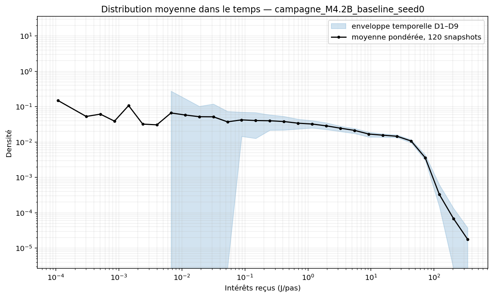

*Lecture de cette figure (produite directement par le moteur de
simulation, pas retouchée) : chaque point est la densité moyenne, sur
120 instantanés, du montant d'intérêt reçu par les entités actives à un
instant donné. L'axe des deux côtés est logarithmique : une vraie loi de
Pareto y apparaîtrait comme une droite sur la partie haute (à droite).
Ici, la courbe s'incurve et chute abruptement au-delà de ~50 J/pas — le
« coude » évoqué plus haut, présent dans toutes les simulations de ce
programme. C'est précisément ce qui a rendu le test d'existence
impossible à trancher (§4) et qui motive de poser l'existence de la
queue de Pareto comme hypothèse plutôt que de continuer à la tester.*

**Exemple travaillé — comment le seuil est choisi et comment α̂ et son
incertitude bootstrap sont calculés.** La figure ci-dessous applique le
code de caractérisation (`scripts/tail_test.py`,
`scripts/admissibility_factor.py`, sans aucune modification) à un
instantané réel : baseline, graine 0, pas t=2225 (choisi car son α̂ est
le plus proche de la moyenne des 91 instantanés identifiables de ce run
— ni un cas particulièrement stable, ni particulièrement instable).

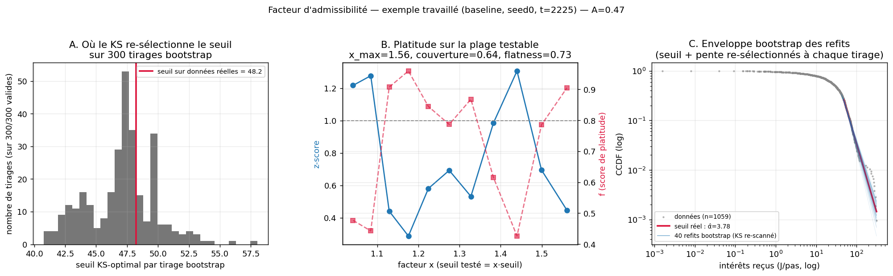

*Panneau A — 300 tirages bootstrap (rééchantillonnage avec remise,
seuil KS **re-sélectionné à chaque tirage**) : la distribution des
seuils retrouvés est unimodale, centrée juste au-dessus du seuil sur
les données réelles (ligne rouge, 48,2) — pas de second mode qui
indiquerait que le coude est parfois accroché à la place de la vraie
cassure sur cet instantané. C'est cette distribution qui donne
l'écart-type bootstrap de α̂ (intra-instantané, §4) : 0,34 en moyenne
sur les 129 runs caractérisés — nettement plus large que la dispersion
entre graines (§5). Panneau C — l'enveloppe des 40 refits bootstrap
(seuil et pente re-sélectionnés à chaque tirage) tracée directement sur
la CCDF empirique : visualisation directe de cette incertitude. Le
panneau B (test de platitude par facteur de seuil) est un diagnostic
historique de la tentative de test d'existence (§4) — gardé pour
traçabilité, plus utilisé comme critère.*

## 4. Du test d'existence à la caractérisation : ce qui a changé et pourquoi

**Ce qui a été tenté d'abord.** Le protocole pré-enregistré (avant tout
résultat de confirmation) définissait un test d'existence en 5 critères
pour qualifier une queue de Pareto de « robuste » — le premier
(stabilité de l'exposant α̂ quand le seuil varie) s'est révélé être la
condition qui bloque tout : sur les 45 runs de confirmation, il
échouait 0/5 graines, sur les 9 cellules, sans exception. Deux révisions
successives de ce critère ont été tentées :

1. **Seuil moitié vs seuil optimal** (version initiale du protocole) :
   rejetée après relecture — ce test compare la queue au corps de la
   distribution (déjà modélisé séparément par GB2), pas la queue à
   elle-même ; il échoue quasiment par construction.
2. **Seuil ×2 vs seuil optimal** (auto-similarité d'une vraie loi de
   puissance, la bonne idée) : recalculée sur les instantanés
   effectivement utilisables (`scripts/probe_criterion1_2x.py`) — à
   seuil ×2, le nombre de points de queue tombe de 113 (médiane) à 17,
   et seulement 2 % des instantanés atteignent le plancher de fiabilité
   déjà utilisé partout ailleurs dans ce pipeline (n≥80). **Le test
   n'est pas calculable de façon fiable avec le volume de données de ce
   programme.**
3. Un **facteur d'admissibilité continu** (couverture × platitude,
   incertitude bootstrap, seuil KS re-sélectionné à chaque tirage —
   détail dans `scripts/admissibility_factor.py`) a ensuite été essayé
   pour remplacer le pass/fail brutal par une mesure graduée. Résultat,
   sur les 132 runs (1331 instantanés) : **A < 0,5 pour les 37 cellules,
   sans exception**, plafonnant à 0,47. Décomposition : couverture
   médiane 0,22 (on ne peut tester que ~17 % du chemin vers ×2 avant de
   manquer de points), platitude médiane 0,56 (29 % des instantanés ont
   une platitude ≥0,75 — là où on *peut* tester, ça ne s'écarte souvent
   pas franchement du bruit). **Le facteur limitant est presque partout
   le volume de données disponible dans la queue extrême, pas une
   preuve de courbure.**

**Décision** (2026-08-06) : puisqu'aucune version du test d'existence
n'aboutit à un résultat tranchable — ni « oui, robuste » ni « non,
clairement pas une loi de puissance » — l'existence d'une queue de
Pareto pour les revenus d'intérêt est **posée comme hypothèse de
travail**, en reconnaissant explicitement le « coude » observé dans
toutes les simulations après la cassure. Ce que ce rapport caractérise
à partir d'ici : **α̂ et son incertitude**, pas son existence.

**Comment α̂ et son incertitude sont maintenant calculés :**

- **Fenêtre d'analyse par run**, à partir du temps de relaxation du
  renouvellement du décile supérieur (régression FOPDT — délai + décroissance
  exponentielle — sur la persistance du décile supérieur, voir §6) plutôt
  que d'un burn-in fixe T/4 : runs « légers » (marge suffisante avant
  T) → plusieurs instantanés espacés d'au moins ~τ après convergence ;
  runs « sévères » (K0\_2000, K0\_500, gamma\_0.3333, gamma\_0.4000,
  control\_geometric, K0\_100 — pas de marge avant T) → **un seul
  instantané, le dernier disponible, signalé explicitement comme non
  stationnaire confirmé**.
- **α̂ par instantané** : seuil KS-optimal, exposant MLE au-delà.
- **Écart-type bootstrap intra-instantané** : 300 tirages avec remise,
  seuil KS **re-sélectionné à chaque tirage** (pas fixé — ça capture
  aussi la variabilité du choix de seuil, plus robuste à un coude qui
  se déplacerait entre tirages).
- **Trois échelles d'incertitude, jamais fusionnées** (§3) :
  intra-instantané, inter-instantanés (pour les runs légers, plusieurs
  points), inter-graines (dispersion de la moyenne de run entre les 3
  ou 5 graines d'une cellule).

**Constat qui organise la lecture du reste du rapport** : sur 129 runs
caractérisés, l'écart-type intra-instantané (moyenne 0,338) est
**environ 3,7× plus grand** que l'écart-type inter-graines au niveau
cellule (moyenne 0,092). Autrement dit, lire α̂ sur une seule coupe
transversale est nettement moins précis que ne le suggère la
reproductibilité, très bonne, de la *moyenne de cellule* d'une graine à
l'autre. Les effets de paramètres discutés au §6 sont jugés à l'aune de
l'écart-type inter-graines (le plus directement comparable à un effet
de paramètre reproductible), avec l'écart-type intra-instantané rappelé
en contexte partout où il est pertinent — en particulier pour les
cellules sévères, qui n'ont qu'un seul instantané par graine et donc
aucune dispersion inter-instantanés calculable.

Pour l'objectif B (indépendance de taille de l'exposant d'avalanche),
le protocole exige de comparer les tailles de population les plus
petites et les plus grandes **à paramètres autrement identiques**. Comme
expliqué au §8, aucune des 9 cellules de confirmation ne remplit cette
condition — le verdict objectif B n'est donc pas calculable à partir de
la confirmation (voir §8 pour le détail et la seule évidence
disponible, celle du pilote).

---

## 5. Résultat central : α̂ caractérisé, pas testé

**Aucune des 37 cellules n'atteint un niveau de preuve permettant de
trancher l'existence d'une queue de Pareto robuste** (§4) — mais α̂ est
mesurable partout, reproductible d'une graine à l'autre, et varie de
façon interprétable avec les paramètres testés (détail §6). Les valeurs
de cellule (moyenne sur les graines, seuil KS) vont de **2,97
(K0=2000)** à **4,84 (`gamma_comp_0.3333`)**, avec un écart-type
inter-graines médian de seulement 0,070 — beaucoup plus petit que
l'écart-type intra-instantané (médian 0,341, §4).

**Fait observé** : les cellules sévères (K0\_2000 en tête) n'échappent
pas à la règle malgré l'absence de fenêtre stationnaire confirmée —
K0\_2000 donne α̂=2,969 (exploration) et 2,986 (confirmation),
écart-type inter-graines 0,007 et 0,053 respectivement : l'estimation
ponctuelle elle-même est très reproductible, même si le régime dont
elle est issue n'est pas confirmé stationnaire. C'est une distinction
importante à ne pas perdre : *reproductible* n'est pas *stationnaire
établi*.

**Conclusion sur l'objectif A** : le programme ne permet pas d'affirmer
qu'une région de l'espace des paramètres donne une queue de Pareto
robuste au sens strict — ce test n'a jamais pu être rendu concluant,
faute de données suffisantes dans la queue extrême (§4). Ce qui est
solidement établi : **α̂, sous l'hypothèse d'une loi de puissance,
répond aux paramètres de façon reproductible et interprétable** — c'est
le contenu du §6, qui devient de fait le résultat substantiel de ce
rapport.

## 6. Comment α̂ varie avec les paramètres (sous l'hypothèse Pareto)

Toutes les valeurs α̂ ci-dessous sont des moyennes de cellule (seuil
KS, sur les instantanés retenus par run — §4) ± écart-type
**inter-graines** (le plus pertinent pour juger si un effet dépasse le
bruit de reproductibilité). L'écart-type **intra-instantané** (plus
grand d'un facteur ~3,7 en moyenne, §4) est rappelé pour les cellules
sévères, qui n'ont qu'un seul instantané par graine.

### Fenêtre d'analyse : temps de relaxation du renouvellement

Avant de pouvoir dire quel instantané est représentatif d'un régime
stationnaire, il a fallu mesurer le temps de relaxation du système.
Le renouvellement du décile supérieur (persistance dans le temps de
l'élite identifiée au premier instantané) suit remarquablement bien un
modèle « premier ordre + délai » (FOPDT, réponse indicielle classique) :

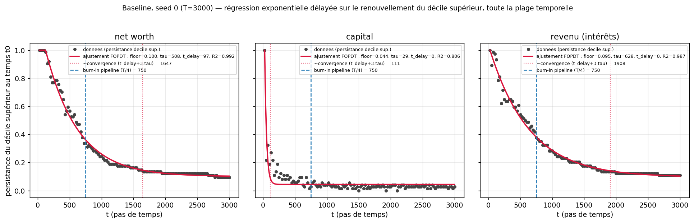

*Ajustement sur toute la plage temporelle disponible (pas seulement la
fenêtre de confirmation), baseline graine 0 : R²=0,992 (net worth) et
0,987 (revenu) — excellent. Le temps de convergence estimé
(t\_delay+3·τ) est ~1650-1900 pas, contre un burn-in fixe de 750 (T/4)
utilisé jusqu'ici partout dans le pipeline : la fenêtre standard ne
couvrait qu'environ 40 % du temps de relaxation réel sur cette cellule.
Le capital (K), lui, relaxe quasi instantanément (τ≈29) — cohérent avec
l'homogénéisation rapide déjà documentée.*

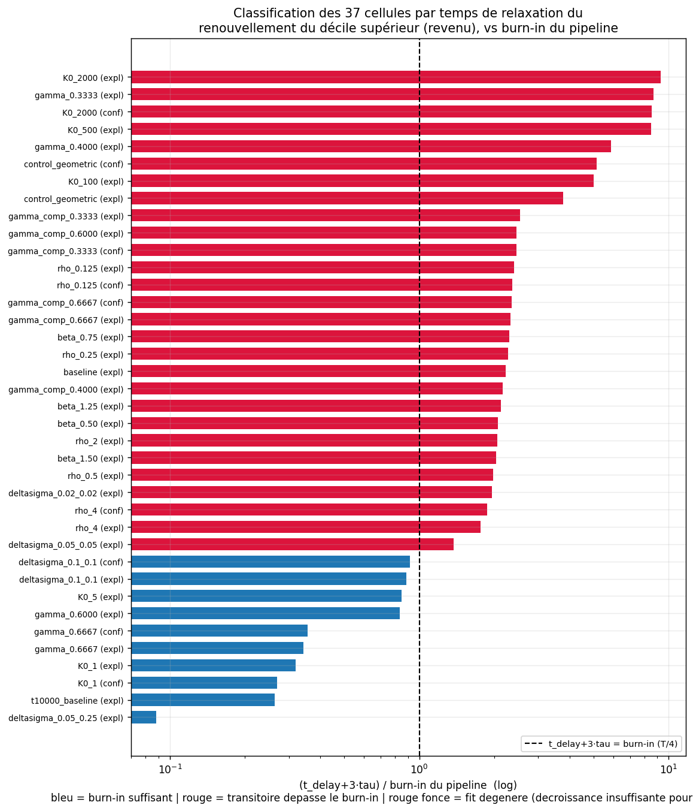

*Appliqué aux 37 cellules : le capital est toujours rapide (0 problème),
mais le revenu d'intérêt et le net worth dépassent le burn-in standard
dans 27 cellules sur 37 — de peu (`deltasigma_0.05_0.05` : ×1,4) à
massivement (`K0_2000` : ×10-11). C'est ce classement qui définit les
runs « légers » (fenêtre repositionnée après convergence) et « sévères »
(pas de marge, un seul instantané, §4).*

### η (le levier le plus systématique)

| ρ | α̂ (confirmation) | τ̂ | branchement |
|---|---:|---:|---:|
| 0,125 | 4,172 ± 0,261 | 1,815 | 0,478 |
| 1 (baseline, exploration) | 3,890 ± 0,020 | 1,412 | 0,786 |
| 4 | 4,130 ± 0,134 | 0,989 | 0,891 |

Effet non monotone (les deux extrêmes ont un α̂ plus élevé que la
baseline), et l'écart-type inter-graines grandit nettement aux extrêmes
(0,26 à ρ=0,125, contre 0,02 à la baseline) — l'effet reste net mais
moins précis qu'à baseline. Le rapport de branchement, lui, reste
parfaitement monotone : 0,478 (ρ=0,125) → 0,786 (baseline) → 0,891
(ρ=4) — η est avant tout un levier sur l'**intensité des cascades**, pas
seulement sur les intérêts. Le paramètre β (η non linéaire) n'a en
revanche **aucun effet mesurable** : α̂ reste dans 3,80-3,89 sur toute la
plage testée, barres d'erreur largement chevauchantes.

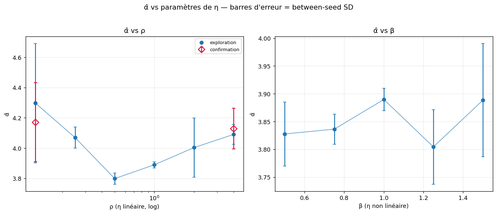

*Panneau gauche : α̂ vs ρ, non monotone mais net. Panneau droit : α̂ vs
β, plat — aucun effet distinguable du bruit.*

| 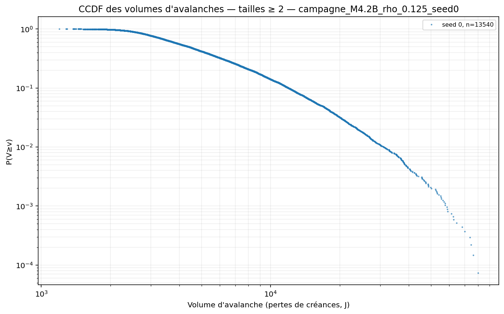 | 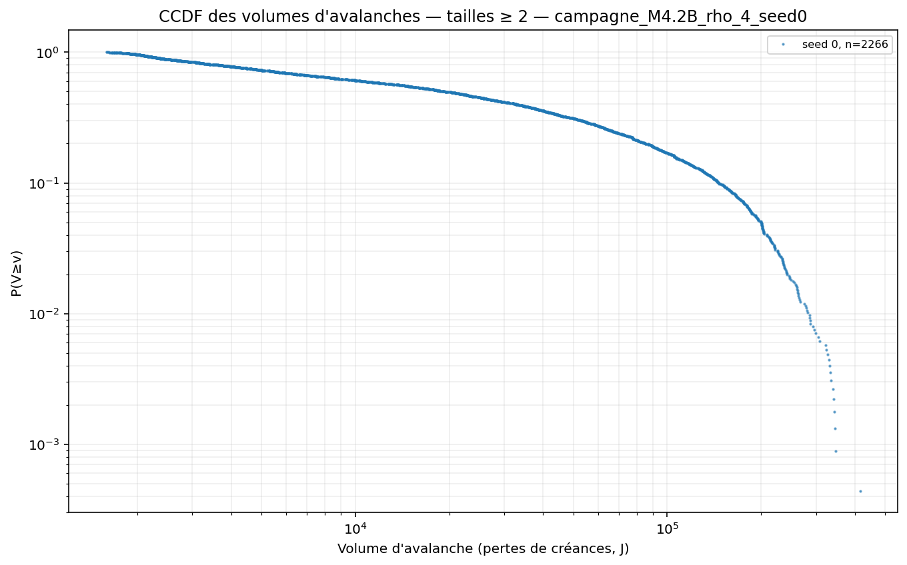 |
|:---:|:---:|

*Comparaison directe (sorties brutes du moteur, une graine
d'exploration chacune) : à gauche, ρ=0,125 (marché clairsemé), les
avalanches restent petites (volume maximal ≈5×10⁴) et la CCDF
s'incurve tôt. À droite, ρ=4 (marché dense), les avalanches atteignent
des volumes dix fois plus grands (≈5×10⁵) sur une pente plus soutenue
avant de s'incurver — signature visuelle directe d'une dynamique plus
critique, cohérente avec le rapport de branchement plus élevé
(0,891 contre 0,478).*

### K0 (mécanisme deg_out, effet non simple, deux cellules sévères)

| K0 | α̂ | écart-type | statut | population | plancher renouvellement |
|---|---:|---:|---|---:|---:|
| 1 | 3,592 (conf) / 3,641 (expl) | 0,072 / 0,081 | léger | 362-429 | 0,000 |
| 25 (baseline) | 3,890 | 0,020 | léger | ~1147 | 0,088 |
| 100 | 3,665 | 0,128 | **sévère** | ~1980 | — |
| 500 | 3,266 | 0,113 | **sévère** | ~3850 | — |
| 2000 | 2,986 (conf) / 2,969 (expl) | 0,053 / 0,007 | **sévère** | 7152-7326 | 0,796 |

Effet net et non monotone, confirmé sur graines disjointes aux deux
extrêmes retenus pour confirmation (K0=1, K0=2000). K0=100, 500 et 2000
sont des cellules **sévères** : un seul instantané par graine, régime
stationnaire non confirmé (§4, fig9) — mais l'estimation elle-même reste
très reproductible (K0=2000 : écart-type inter-graines 0,007 à 0,053,
parmi les plus faibles de toute la campagne). Le changement le plus
spectaculaire reste qualitatif : le plancher de renouvellement de
l'élite passe de 0 (turnover total, K0=1) à 0,796 (élite quasi figée,
K0=2000) — K0 contrôle autant la mobilité sociale de long terme que la
forme apparente de la queue. **Prudence** : la comparaison K0=1 vs
K0=2000 mélange donc un point bien caractérisé (K0=1, léger) et un point
ponctuel non stationnaire confirmé (K0=2000, sévère) — l'écart mesuré
(~0,6) est robuste statistiquement mais ne doit pas être lu comme deux
régimes stationnaires comparés à égalité.

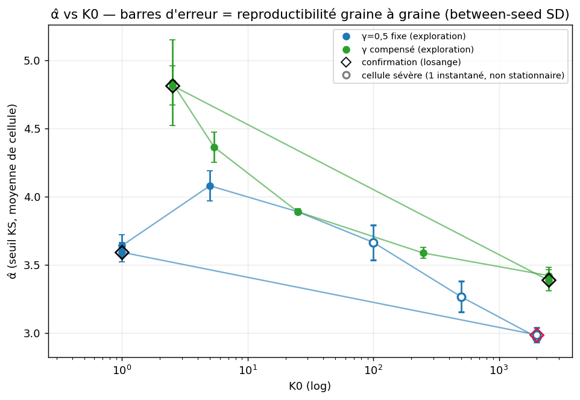

*Marqueurs creux = cellules sévères. Losanges = confirmation. Les deux
branches (γ=0,5 fixe et γ compensé) montrent le même sens d'effet ;
l'écart entre les deux (compensé toujours au-dessus) montre que γ et K0
interagissent plutôt que de se substituer l'un à l'autre.*

| 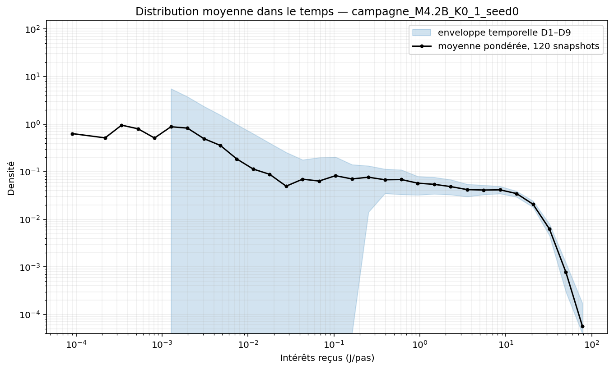 | 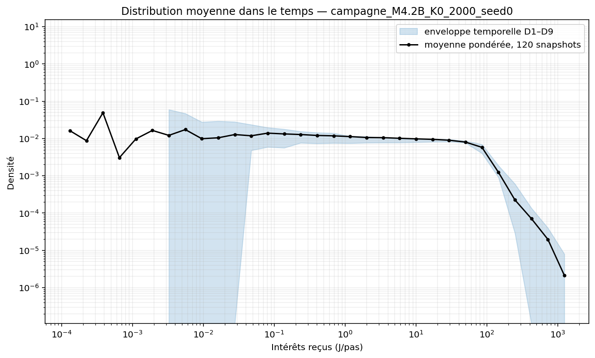 |
|:---:|:---:|

*Sortie brute du moteur : à K0=2000 (droite), la courbe s'étend sur
près de 3 décennies de plus en abscisse (jusqu'à ~10³ J/pas contre ~10²
à K0=1) et reste plus haute plus longtemps avant de s'effondrer —
visuellement plus proche d'une droite en échelle log-log, cohérent avec
le α̂ plus bas mesuré à K0=2000. Rappel : instantané unique côté K0=2000
(cellule sévère), pas une moyenne sur fenêtre stationnaire.*

| 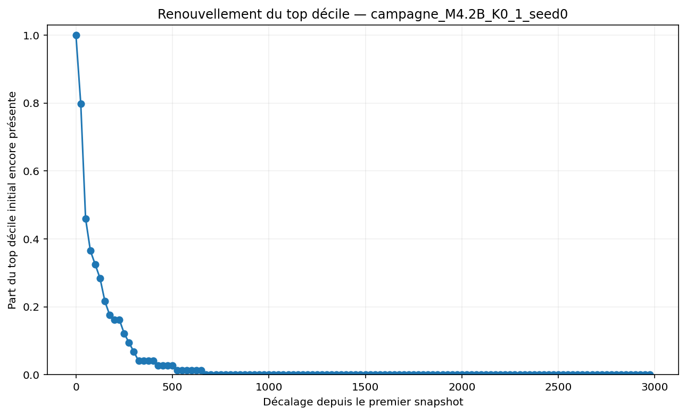 | 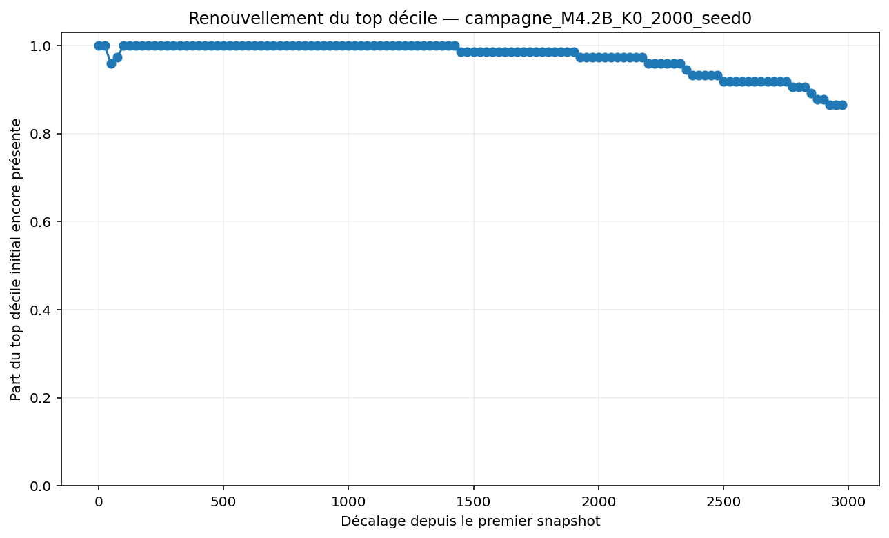 |
|:---:|:---:|

*Le contraste le plus spectaculaire de toute la campagne : à K0=1
(gauche), l'élite initiale du décile supérieur est presque entièrement
renouvelée en moins de 1000 pas. À K0=2000 (droite), la même élite reste
identifiable à plus de 85 % de sa composition initiale jusqu'à la fin
des 3000 pas simulés — cohérent avec le diagnostic FOPDT : ce n'est pas
qu'un régime stationnaire tarde à s'installer, la persistance elle-même
reste élevée (~0,8-0,9) tout du long, un ajustement à décroissance
lente est mal contraint sur des données aussi plates.*

### γ (effet réel seulement une fois l'échelle contrôlée)

| γ | α̂ (K0=25, brut) | α̂ (K0 compensé) |
|---|---:|---:|
| 1/3 | 3,793 ± 0,123 (sévère) | 4,835 ± 0,314 (expl) / 4,816 ± 0,143 (conf) |
| 0,5 (baseline) | 3,890 ± 0,020 | 3,890 ± 0,020 |
| 2/3 | 3,374 ± 0,024 (expl) / 3,337 ± 0,031 (conf) | 3,421 ± 0,062 (expl) / 3,387 ± 0,079 (conf) |

La branche compensée confirme la décroissance nette observée en
exploration : plus la production est concave (γ petit), plus la queue
apparente est lourde (α̂ plus grand). La branche brute (K0=25 fixe) est
nettement plus plate — confondue avec l'effet d'échelle de K0 tant que
K0/K\*aut n'est pas tenu constant. C'est le signal le plus propre de
toute la campagne pour un paramètre autre que η, confirmé sur graines
disjointes aux deux extrêmes compensés.

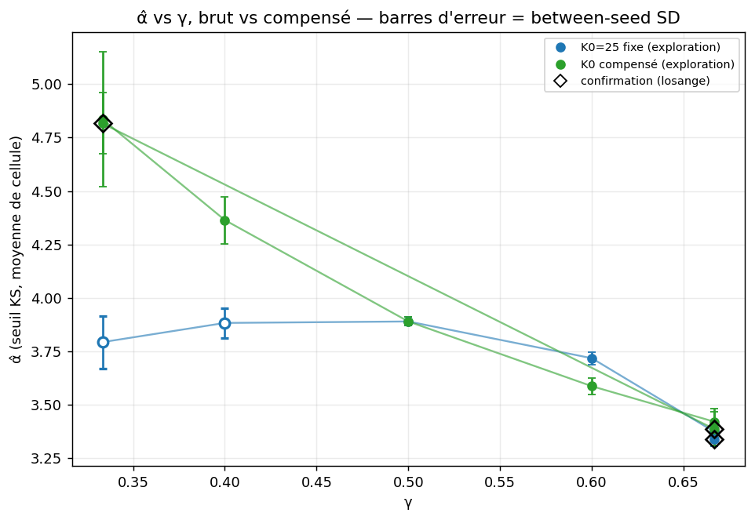

*La ligne bleue (K0 fixe) est quasi plate ; la ligne verte (K0
compensé) décroît nettement. Les deux se rejoignent à γ=0,5 par
construction (baseline commune). Losanges = confirmation.*

### δ, σ conjoints

`deltasigma_0.1_0.1` (δ=σ=0,10) confirme le signal exploratoire : α̂ =
3,054 ± 0,035 (confirmation) / 3,042 ± 0,010 (exploration), contre 3,890
à baseline — la valeur la plus basse de tout le balayage δ=σ conjoint
(0,01→0,10, monotone décroissant), tandis que le rapport de branchement
s'effondre en parallèle à 0,386 (contre 0,786 en baseline). Un point
hors de ce sweep conjoint (δ=0,05 fixe, σ=0,25 seul, réglage historique
M4.2) donne au contraire α̂=4,382 ± 0,061 : δ et σ ne poussent donc pas
dans le même sens quand on les sépare, seul leur mouvement **conjoint**
fait décroître α̂. La direction du compromis (α̂ plus bas, criticité des
avalanches plus basse) reste la même que celle documentée en
exploration, maintenant confirmée sur graines disjointes.

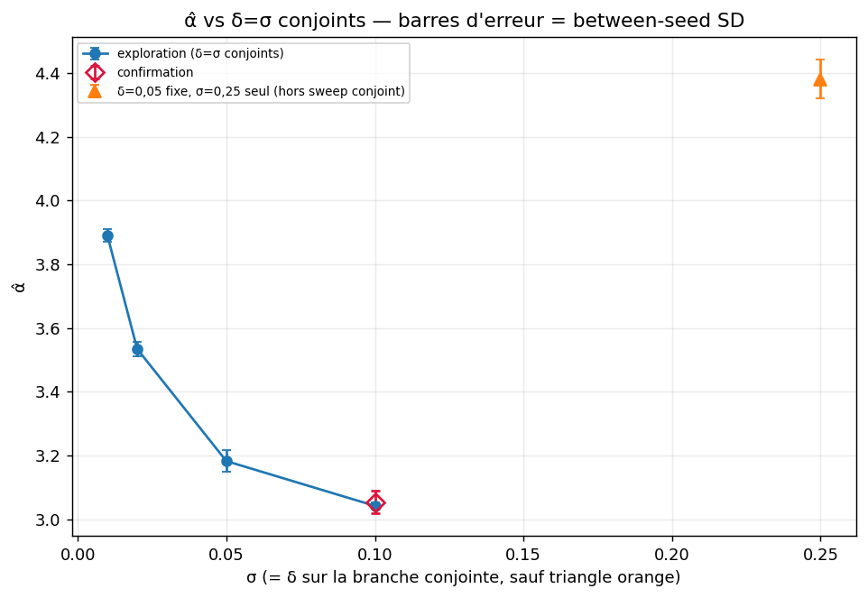

*La branche bleue (δ=σ, sweep conjoint) décroît nettement ; le triangle
orange (δ=0,05 fixe, σ=0,25 seul) sort de cette tendance — preuve directe
que ce n'est pas σ seul qui pilote l'effet.*

## 7. Réponses aux 17 questions du cahier des charges

**1. Que change la cible arithmétique par rapport à la cible géométrique ?**
Le principal des deux parties est ramené exactement à leur moyenne
(contre la moyenne géométrique en M4.2), avec un principal non borné
plus élevé pour les paires très inégales. À baseline autrement
identique, la cible arithmétique donne une queue apparente plus légère
que la cible géométrique : α̂=3,890 ± 0,020 (arithmétique) contre
α̂=3,318 ± 0,113 (géométrique, `control_geometric`, **cellule sévère** —
un seul instantané par graine, régime stationnaire non confirmé, §4) —
même sens qu'en exploration, confirmé sur graines disjointes malgré la
réserve sur la cellule géométrique. **Fait observé** (confirmé), sous
l'hypothèse Pareto désormais posée au §4.

**2. Quelle est la forme du corps de la distribution instantanée des intérêts ?**
GB2 (famille à 4 paramètres) gagne systématiquement par AIC sur les
snapshots testés en phase pilote ; l'exponentielle/Weibull restent très
compétitives à 1-2 paramètres. **Fait observé, phase pilote uniquement**
— non re-testé systématiquement sur les 9 cellules de confirmation
(hors périmètre du temps disponible ; aucune raison dans les données
d'exploration/confirmation de douter de ce résultat, mais pas
re-vérifié).

**3. Existe-t-il une queue Pareto robuste des intérêts ? Dans quelles régions du modèle ?**
**La question n'a pas pu être tranchée, dans aucun sens.** Trois
versions successives d'un test d'existence ont été essayées (§4) ; la
dernière (facteur d'admissibilité continu, bootstrap, 132 runs) donne
A<0,5 partout, mais la décomposition montre que c'est presque
entièrement un problème de **volume de données dans la queue extrême**
(couverture médiane 0,22), pas une preuve de courbure (platitude
médiane 0,56, correcte là où elle est mesurable). Ce n'est donc ni
« oui, robuste » ni « non, clairement pas Pareto » : c'est **non
testable avec les données de ce programme**. Décision prise en
conséquence (§4) : l'existence est posée comme hypothèse de travail, et
ce rapport caractérise α̂ sous cette hypothèse plutôt que de continuer à
chercher à trancher l'existence elle-même.

**4. Quelle famille globale ou composite décrit le mieux la distribution ?**
GB2 pour le corps (voir Q2) ; aucune composite à raccord Pareto explicite
n'apporte quoi que ce soit par rapport à GB2/mélange lognormal en phase
pilote. **Fait observé, phase pilote uniquement**, même réserve que Q2.

**5. Quel est le domaine accessible des exposants de queue des intérêts ?**
α̂ (moyenne de cellule, seuil KS, sous l'hypothèse Pareto posée au §4)
varie de **2,969-2,986** (K0=2000, exploration/confirmation, cellule
sévère) à **4,816-4,835** (`gamma_comp_0.3333`, confirmation/exploration)
sur l'ensemble exploration+confirmation — un facteur ~1,6. **Attention**
: l'existence même de la loi de puissance n'étant pas établie (Q3), ce
ne sont pas des exposants Pareto démontrés, mais des ajustements
reproductibles graine à graine (écart-type inter-graines médian 0,070,
§4) sous l'hypothèse de travail. **Fait observé** avec cette réserve.

**6. Quels paramètres contrôlent principalement cette queue (apparente) ?**
η (effet le plus systématique, non monotone, sur α̂ ET sur le rapport de
branchement des avalanches), γ une fois l'échelle contrôlée (effet le
plus propre et monotone), K0 (effet fort mais non monotone, deux
cellules sévères aux extrêmes hauts), δ/σ conjoints (effet monotone
marqué sur α̂, avec effondrement parallèle du rapport de branchement).
β (η non linéaire) n'a aucun effet mesurable — barres d'erreur
largement chevauchantes sur toute la plage testée. **Fait observé** (§6).

**7. Quel rôle spécifique joue η ?**
Le levier le plus systématique du grid : contrôle à la fois α̂ (effet
non monotone mais net, 3,89→4,17-4,30 aux extrêmes) et — de façon
parfaitement monotone — τ̂ et le rapport de branchement des avalanches
(0,478 à ρ=0,125 → 0,786 à baseline → 0,891 à ρ=4). **Fait observé,
confirmé** sur graines disjointes.

**8. Quel rôle jouent K0, γ, λ, δ et σ ?**
K0 : mécanisme deg\_out (quantité de contrats), effet dominant sur la
mobilité sociale de long terme (plancher de renouvellement 0,000→0,796),
effet non monotone sur α̂, deux cellules sévères aux extrêmes hauts
(K0=500, 2000, régime stationnaire non confirmé). γ : confondu avec
l'échelle sauf compensation K0/K\*aut ; une fois compensé, effet propre
et monotone (α̂ 3,89→4,82 quand γ diminue). δ, σ : effet monotone marqué
sur α̂ (3,89→3,04 sur le sweep conjoint), en parallèle d'un effondrement
de la criticalité des avalanches — mais δ=0,05,σ=0,25 seul (hors sweep
conjoint) donne un effet opposé (α̂=4,38), donc ce n'est pas σ seul qui
pilote. λ : non re-testé en exploration/confirmation (fixé à 30) ; seule
évidence disponible, le balayage du pilote (λ∈{10;30;100}), qui montre
une dérive de τ̂ et un estimateur de coupure saturé à λ=100 —
**incertitude** sur le rôle de λ au-delà du pilote.

**9. Quel rôle jouent respectivement r, q et rq ?**
Mécanisme établi en pilote : r quasi constant, dispersion du log-revenu
dominée à 77 % par le nombre de contrats accumulés (deg\_out), 23 % par
rq moyen. Les écarts de la part deg\_out par rapport à la baseline,
mesurés maintenant sur les 9 cellules de confirmation (`delta_share_
deg_out_vs_baseline`, `results/confirmation/confirmation_verdicts.csv`),
vont de -0,17 (rho\_0.125, gamma\_0.6667, deltasigma\_0.1\_0.1) à +0,07
(control\_geometric) — le mécanisme quantité/prix reste actif et
mesurable sur un ensemble de cellules bien plus large qu'en pilote.
**Fait observé** (pilote) **et confirmé plus largement** (exploration +
confirmation).

**10. La règle de taux géométrique produit-elle des effets pathologiques ?**
Non au sens service : 0 défaut de liquidité observé en pilote. Oui au
sens levier : un service c=rq tel que c/F_γ(K_b')≈1,57 dès la création
du contrat pour certaines paires, résolu en faillite différée
(insolvabilité), jamais en défaut de service immédiat. **Fait observé,
phase pilote uniquement** — non re-vérifié systématiquement sur
exploration/confirmation.

**11. Les avalanches conservent-elles une structure en loi de puissance dans les mêmes régimes ?**
Descriptivement oui : sur les 9 cellules de confirmation, le rapport de
branchement reste non nul et varie de façon interprétable (0,386 à
0,891) — jamais éteint. Mais l'**indépendance de taille** de l'exposant
τ̂, qui est le sens précis du critère du protocole, n'est **pas établie
et n'est pas testable** avec la conception actuelle de la confirmation
(voir §8 ci-dessous). **Fait observé** (persistance descriptive) +
**incertitude** (indépendance de taille).

**12. Existe-t-il un compromis entre la queue des revenus et la criticalité des cascades ?**
Oui, clairement, sur la branche δ/σ : la valeur la plus basse d'α̂ de
tout le sweep conjoint (`deltasigma_0.1_0.1`, α̂≈3,05) est aussi celle
où le rapport de branchement s'effondre le plus (0,786→0,386). **Fait
observé, confirmé** sur graines disjointes.

**13. Quel domaine de paramètres satisfait simultanément les deux objectifs ?**
Question désormais mal posée telle quelle : l'objectif A n'a pu être ni
établi ni infirmé au sens strict (Q3), donc « satisfaire l'objectif A »
n'a pas de réponse binaire. Sous l'hypothèse Pareto (§4), aucune des 9
cellules de confirmation ne combine un déplacement notable d'α̂ ET un
rapport de branchement préservé proche de la baseline (0,786) — le seul
mouvement net sur α̂ dans le sens d'une queue plus légère (δ=σ) coûte
systématiquement en criticalité des avalanches. **Fait observé**
(sous l'hypothèse Pareto), la question au sens strict du protocole
restant **non tranchable**.

**14. Les effets survivent-ils aux graines, au temps et à la taille du système ?**
Graines : oui, très bien — écart-type inter-graines médian 0,070 sur
les cellules de confirmation (§4-5), nettement plus petit que l'écart-type
intra-instantané (médian 0,341) : la moyenne de cellule est reproductible
même quand un instantané isolé serait bruité. Temps : la cellule à
T=10000 reste dans la même gamme d'α̂ que T=3000. Taille : **non
testable** avec la conception actuelle (voir §8) — **incertitude**.

**15. Quels changements observés relèvent d'un exposant, d'une coupure, d'une échelle, d'une masse en zéro ou d'un transitoire ?**
Un « coude » après la cassure est présent dans toutes les simulations de
ce programme (confirmé visuellement, §3) — la question de savoir s'il
s'agit d'une coupure franche (pas d'exposant Pareto authentique) ou
d'une vraie queue de puissance affectée par un manque de données dans
l'extrême n'a **pas pu être tranchée** avec le volume de données
disponible (Q3, §4) : les trois tentatives de test successives
(seuil/2, seuil×2, facteur d'admissibilité continu) échouent toutes par
manque de points dans la queue extrême, pas par preuve claire de
courbure. **Incertitude** — position retenue : traiter l'existence
comme hypothèse et caractériser α̂ dans la région testable, en gardant
explicitement cette réserve à chaque valeur citée.

**16. Si une refonte du modèle a été nécessaire, quelle hypothèse la justifie et quelle ablation démontre son effet ?**
Aucune refonte des mécanismes n'a été effectuée (pas d'ablation de la
règle de taux, pas de fusion/mémoire de contrats). La seule modification
constitutive est la cible arithmétique elle-même, déjà spécifiée par le
programme et vérifiée par parité stricte avec M4.2 (écart flottant
0,000e+00 dans les régimes communs). **Non applicable / non fait**, hors
périmètre du temps disponible.

**17. Quels éléments restent incertains ?**
Voir §8 (limites et non testé) pour la liste complète et sourcée.

## 8. Limites et non testé

- **Indépendance de taille des avalanches (Objectif B, critère
  formel)** : non établie et non testable avec la conception actuelle
  de la confirmation. Les 9 cellules ont toutes λ=30 fixe ; K0 varie
  fortement la taille de population mais change simultanément
  l'inégalité (Gini ×8), la mobilité (plancher de renouvellement
  0,000→0,796) et le mécanisme de prix (Δshare\_mean\_rq jusqu'à 0,24) —
  ce n'est pas « à paramètres autrement identiques » au sens du
  protocole, et une comparaison K0\_1 vs K0\_2000 pour trancher la
  taille serait non interprétable. La seule évidence disponible dans
  tout le programme est le balayage λ∈{10;30;100} du pilote (une seule
  graine, `resume.md`) : τ̂ dérive de 1,19-1,27 à 1,75, et l'estimateur
  de coupure sature à sa borne numérique à λ=100 (aucune coupure finie
  détectée, exposant non comparable aux deux autres cellules). Conclusion
  du pilote reconduite ici sans changement : **aucun exposant
  d'avalanche indépendant de la taille n'a été établi dans ce
  programme**.
- **Forme du corps de la distribution (GB2 et alternatives), Q2/Q4** :
  établie en phase pilote sur un petit nombre de snapshots, jamais
  re-testée systématiquement sur les 87 runs d'exploration ni les 45 de
  confirmation.
- **Rôle de λ (Q8)** : au-delà du balayage pilote à une graine, non
  re-testé — λ=30 fixe sur toute l'exploration et la confirmation.
- **Pathologie de la règle de taux (Q10)** : vérifiée en pilote
  uniquement (0 défaut de liquidité) ; `book_errors` est collecté par
  run dans `analysis.json` mais n'a pas été systématiquement agrégé sur
  les 132 runs exploration+confirmation pour ce rapport.
- **Refonte de mécanisme (Q16)** : non tentée, faute de temps — le
  prompt complet l'autorise en second recours ; sa nécessité est
  d'autant moins évidente maintenant que l'objectif A n'a pu être ni
  établi ni infirmé (Q3, Q15) plutôt que clairement réfuté.
- **`gamma_comp_0.3333`** : la valeur d'α̂ la plus élevée de toute la
  campagne (4,82-4,84) ; le mécanisme précis n'a pas été creusé
  au-delà de la décomposition deg\_out/rq déjà rapportée (Q9).
- **Test d'existence abandonné, pas résolu (§4)** : les trois versions
  successives du critère 1 (seuil/2, seuil×2, facteur d'admissibilité
  continu) ont toutes échoué à trancher, pour des raisons différentes —
  ce n'est pas une preuve que la queue de Pareto n'existe pas, c'est une
  limite de puissance statistique de ce programme (populations et
  fenêtres temporelles simulées). Un programme futur avec des
  populations plus grandes et/ou des fenêtres plus longues pourrait
  rendre ce test à nouveau calculable.
- **Bootstrap intra-instantané** : rééchantillonne le snapshot
  lui-même (avec remise) ; suppose implicitement les observations
  intra-instantané indépendantes, ce qui n'est vrai qu'approximativement
  (les entités partagent une structure de réseau au même instant). Le
  seuil KS est re-sélectionné à chaque tirage (choix demandé
  explicitement, §4) mais aucune correction de dépendance réseau n'est
  appliquée au-delà de ça.
- **Espacement des instantanés par τ (fenêtre « légère », §4)** :
  l'hypothèse que les instantanés espacés d'au moins un temps
  caractéristique τ (mesuré sur le *renouvellement*) sont
  approximativement décorrélés pour la statistique de *queue des
  intérêts* est une approximation raisonnable, pas une mesure directe
  du temps d'autocorrélation de α̂ lui-même — non vérifiée
  indépendamment.
- **Cellules sévères (K0\_100, K0\_500, K0\_2000, `control_geometric`)** :
  un seul instantané par graine, aucune dispersion inter-instantanés
  calculable, régime stationnaire non confirmé (§4, fig9). Les valeurs
  d'α̂ rapportées pour ces cellules sont reproductibles graine à graine
  (écart-type inter-graines souvent <0,1) mais ne doivent pas être lues
  comme des moyennes de régime établi.

## À ne pas oublier en citant ce rapport

Le résultat central (§4, §5, §7-Q3) est un **résultat honnête sur les
limites de ce qui est démontrable avec ce volume de données**, pas un
échec de calcul ni une limite de temps : trois versions successives d'un
test d'existence de la queue de Pareto ont été tentées, à trois échelles
de preuve croissantes (pilote → exploration → confirmation à graines
disjointes), et aucune n'a pu trancher — la dernière (facteur
d'admissibilité continu, bootstrap) montre que c'est presque partout un
problème de **volume de données dans la queue extrême** (couverture
médiane 0,22 sur l'échelle testée), pas une preuve de courbure
(platitude correcte là où mesurable). **L'existence de la queue de
Pareto est donc posée comme hypothèse de travail** (décision du
2026-08-06, §4), en reconnaissant explicitement le « coude » présent
après la cassure dans toutes les simulations. Sous cette hypothèse, α̂
est mesurable, reproductible d'une graine à l'autre (écart-type
inter-graines médian 0,070, très inférieur à l'écart-type
intra-instantané médian 0,341), et répond de façon interprétable aux
paramètres testés (§6) — c'est ce résultat, positif et quantitatif, qui
constitue l'apport substantiel de ce rapport, à distinguer clairement
de la question (non tranchée) de l'existence elle-même.
